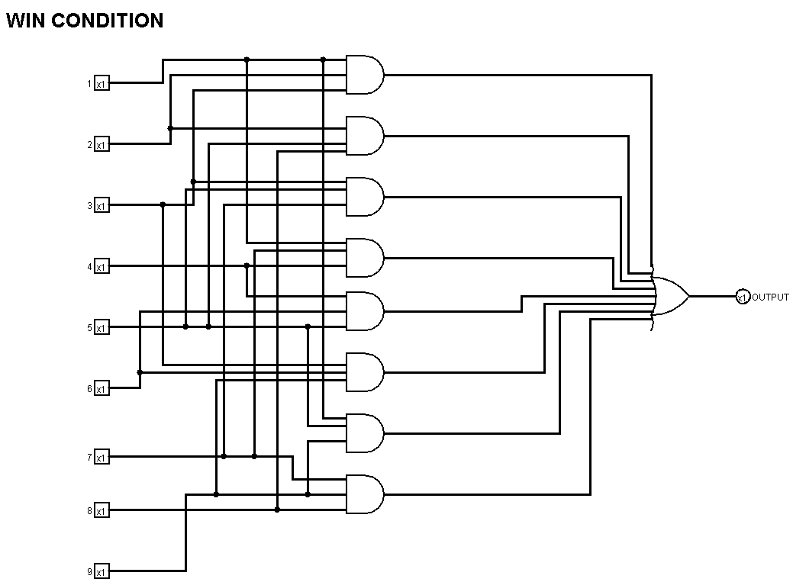
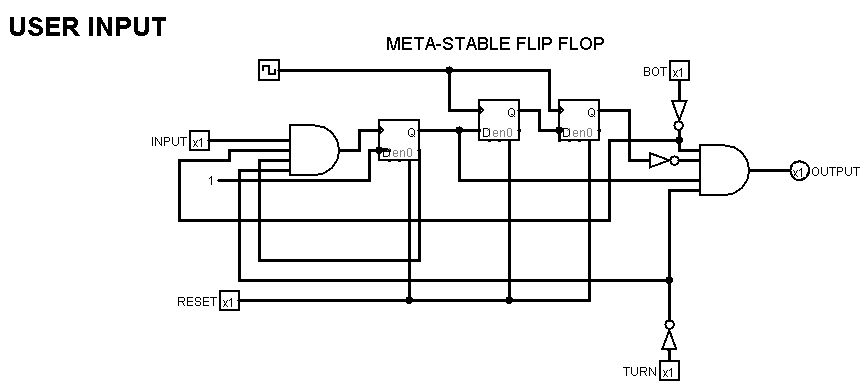
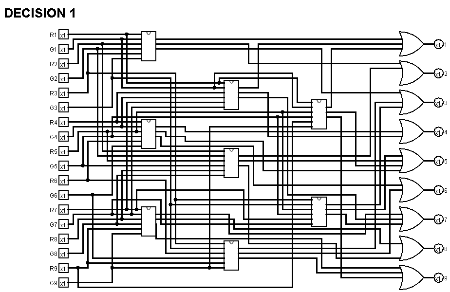
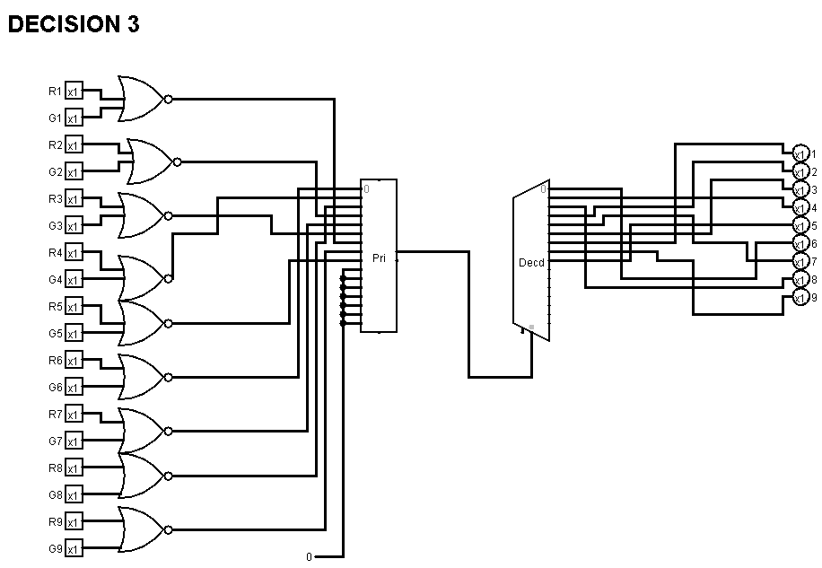

# Autonomous Tic-Tac-Toe Bot

<!-- First Section -->
## Team Details
<details>
  <summary>Detail</summary>

  > Semester: 3rd Sem B. Tech. CSE

  > Section: S1

  > Member-1: Name: M Vineet Nayak, Roll No: 231CS132, email: vineet.231cs132@nitk.edu.in

  > Member-2: Name: Nischal Basavaraju, Roll No: 231CS139, email: nischal.231cs139@nitk.edu.in

  > Member-3: Name: Prahas G R, Roll No: 231CS142, email: prahas.231cs142@nitk.edu.in
</details>

<!-- Second Section -->
## Abstract
<details>
  <summary>Detail</summary>
  
  <h4>Motivation</h4> This topic was chosen to showcase that something as complex and challenging as an autonomous bot can be implemented using something as simple as basic logic gates. This not only allows for a deeper understanding of hardware-level design but also bridges the gap between theoretical digital design concepts and real-world applications. The aim is to explore how classic game strategies can be implemented through hardware.<br><br>
   <h4>Problem Statement</h4> To design and implement a fully autonomous tic-tac-toe playing bot without using microcontrollers or software that plays the game of tic-tac-toe along with the user. This model implements a hardware-based solution to simulate decision-making and strategy using combinational and sequential circuits.<br><br>
  <h4>Features</h4> This autonomous bot will have the following features:
1. Calculates the most optimal move that can be played given the current situation of the game board.<br>
2. Makes use of flip-flops to store the current state of the game.<br>
3. A combination of priority encoder and decoder is used to decide the next optimal move.<br>
4. Uses the programming concept of greedy algorithms to decide the optimal moves.<br>
5. Ensures the same cell is not selected more than once.<br>
</details>

## Functional Block Diagram
<details>
  <summary>Detail</summary>
  
  

</details>

<!-- Third Section -->
## Working
<details>
  <summary>Detail</summary>

  The project operates by allowing both a human player and a bot to take turns placing moves on a
3x3 Tic-Tac-Toe grid. The core structure is built around modules responsible for accepting inputs,
determining optimal bot moves, ensuring valid turns, and detecting game completion.
The game uses separate modules for processing user inputs (userInput) and bot inputs (computerInput). User inputs are captured through an inputModule, and the bot’s move is calculated in the
computerInput module.  
A J-K flip-flop manages turn alternation between the player and the bot.
After every valid move, the flip-flop toggles states, ensuring that players take turns sequentially. To
prevent simultaneous or illegal moves, a meta-stable D flip-flop combination ensures that a player’s
turn is not ”used up” if the player selects a position that is already occupied.
The computerInput module employs several submodules, including decision1, decision2, and
others, alongside a 16-to-1 priority encoder and a 1-to-16 decoder.
<br>
The bot’s logic works as follows:
 Win Check: First, the bot evaluates all vacant positions to see if placing a move in any of them
results in a win.  

Blocking Moves: If no winning move is found, the bot checks whether it can block the player from
winning by placing a move in a critical spot.  

Optimal Move : If neither condition is met, the bot selects an optimal move using predefined
decision-making criteria. The priority encoder ensures that if multiple moves are possible, only one
is selected, preventing conflicting or multiple moves from being executed. 

<br>
Enable Terminals and Multiplexers: Input validation is managed by the enable terminals of the
input modules. Multiplexers are used to ensure that a player cannot make multiple inputs in a
single turn or input at the same time as the bot. This same mechanism also disables input once the
game ends in a win for either the player or the bot. The system guarantees that no further moves
can be made after a game concludes, requiring the user to reset the game before playing again.


Each cell in the 3x3 grid is represented by two LEDs: a red LED to represent the player’s move
and a green LED for the bot’s move. This dual-LED setup allows the players to visually track the
current state of the game board. Additional LEDs indicate whose turn it is and whether a player
has won. These turn-indicator LEDs are updated in synchronization with the J-K flip-flop.  


A dedicated winCondition module monitors the grid after every move to detect any winning
combination. If a win is detected, the game is locked, and no further moves are allowed. This
ensures that gameplay is concluded and the system enters a halt state until the user resets the
board.
Since a tic-tac-toe game can enter into many different states, the truth table for one such game
where the game ends up being a tie.
Also, the state diagram is similar to that of a jk flip flop.
</details>

<!-- Fourth Section -->
## Logisim Circuit Diagram
<details>
  <summary>Detail</summary>
This is the main module of the circuit.
	<details>
  <summary>MAIN</summary>
		This is the main Module where the game is played and all the components are integrated.

  

</details>
The main submodules are
<details>
  <summary>Computer Input</summary>
	This module calculates the most optimal move to be played by the BOT given the current situation of the game using the output of the 
	decision modules.
	

	
</details>
<details>
  <summary>InputModule</summary>
	This module is used to propagate the user's and BOT's input to the display unit if it is valid. This unit prevents the user from making
	an invalid input at any point in the game.

 

</details>
<details>
  <summary>WinCondition</summary>
	This module is used to check if any player(the bot or the user) has won the game in the corresponding move. The output of this module
	decides if the game has ended or not.

 

</details>
<details>
  <summary>UserInput</summary>
	This is perhaps the most distinguishing part of our project. This module contains a meta-stable flip-flop that propagates an input
	pulse only once. This is used in our project to ensure that the turn of the users remains in the same state unless the user selects a 
	valid input. In cases where the user selects invalid inputs such as already selected cells, or tries to play his turn twice, the meta 
	stable flip-flop prevents the move of the user.

 

</details>

The computer input module has the following submodules
<details>
  <summary>Condition-1</summary>
	

</details>
<details>
  <summary>Condition-2</summary>
	

</details>
<details>
  <summary>Decision-1</summary>
  	This module is used to check if the BOT can win the game in the current move given the current situation of the game board, which aids 
   	in the decision making algorithm of the BOT to make its move.

 

</details>
<details>
  <summary>Decision-2</summary>
	This module is used to check if the user can win the game in his/her next move given the current situation of the game board, which aids 
   	in the decision making algorithm of the BOT to make its move.

</details>
<details>
  <summary>Decision-3</summary>
	This module calculates the best possible cell for the BOT to make its move.

</details>

</details>

<!-- Fifth Section -->
## Verilog Code
<details>
  <summary>Detail</summary>

<details>
  <summary>Gate Level Modelling</summary>

```	
//S1-T8_gatelevel.v
//AUTONOMOUS TIC-TAC-TOE BOT
//M Vineet Nayak 231CS132
//Prahas G R 231CS142
//Nischal Basavaraju 213CS139
//S1-T8.v

//condition1 module
module condition1(a, b, c, d, e, f, o1, o2, o3);
	input a, b, c, d, e, f;
	output o1, o2, o3;
	wire nor1, nor2, nor3;
	nor(nor1, a, b);
	nor(nor2, c, d);
	nor(nor3, e, f);
	and(o1, nor1, d, f);
	and(o2, nor2, b, f);
	and(o3, nor3, b, d);
endmodule

//desicion1 module
module desicion1(r1, g1, r2, g2, r3, g3, r4, g4, r5, g5, r6, g6, r7, g7, r8, g8, r9, g9, o1, o2, o3, o4, o5, o6, o7, o8, o9);
	input r1, g1, r2, g2, r3, g3, r4, g4, r5, g5, r6, g6, r7, g7, r8, g8, r9, g9;
	output o1, o2, o3, o4, o5, o6, o7, o8, o9;
	wire m1a, m1b, m1c, m2a, m2b, m2c, m3a, m3b, m3c, m4a, m4b, m4c;
	wire m5a, m5b, m5c, m6a, m6b, m6c, m7a, m7b, m7c, m8a, m8b, m8c;
	
	condition1 mod1(r1, g1, r2, g2, r3, g3, m1a, m1b, m1c);
	condition1 mod2(r4, g4, r5, g5, r6, g6, m2a, m2b, m2c);
	condition1 mod3(r7, g7, r8, g8, r9, g9, m3a, m3b, m3c);
	condition1 mod4(r1, g1, r4, g4, r7, g7, m4a, m4b, m4c);
	condition1 mod5(r2, g2, r5, g5, r8, g8, m5a, m5b, m5c);
	condition1 mod6(r3, g3, r6, g6, r9, g9, m6a, m6b, m6c);
	condition1 mod7(r1, g1, r5, g5, r9, g9, m7a, m7b, m7c);
	condition1 mod8(r3, g3, r5, g5, r7, g7, m8a, m8b, m8c);
	
	or(o1, m1a, m4a, m7a);
	or(o2, m1b, m5a);
	or(o3, m1c, m6a, m8a);
	or(o4, m2a, m4b);
	or(o5, m2b, m5b, m7b, m8b);
	or(o6, m2c, m6b);
	or(o7, m3a, m4c, m8c);
	or(o8, m3b, m5c);
	or(o9, m3c, m6c, m7c);

endmodule

//condition2 module
module condition2(a, b, c, d, e, f, o1, o2, o3);
    input a, b, c, d, e, f;
    output o1, o2, o3;
    wire nor1, nor2, nor3;
    nor(nor1, a, b);
    nor(nor2, c, d);
    nor(nor3, e, f);

    and(o1, nor1, c, e);
    and(o2, nor2, a, e);
    and(o3, nor3, a, c);
endmodule

//desicion2 module
module desicion2(r1, g1, r2, g2, r3, g3, r4, g4, r5, g5, r6, g6, r7, g7, r8, g8, r9, g9, o1, o2, o3, o4, o5, o6, o7, o8, o9);
    input r1, g1, r2, g2, r3, g3, r4, g4, r5, g5, r6, g6, r7, g7, r8, g8, r9, g9;
    output o1, o2, o3, o4, o5, o6, o7, o8, o9;
    wire m1a, m1b, m1c, m2a, m2b, m2c, m3a, m3b, m3c, m4a, m4b, m4c;
    wire m5a, m5b, m5c, m6a, m6b, m6c, m7a, m7b, m7c, m8a, m8b, m8c;
    
    condition2 mod1(r1, g1, r2, g2, r3, g3, m1a, m1b, m1c);
    condition2 mod2(r4, g4, r5, g5, r6, g6, m2a, m2b, m2c);
    condition2 mod3(r7, g7, r8, g8, r9, g9, m3a, m3b, m3c);
    condition2 mod4(r1, g1, r4, g4, r7, g7, m4a, m4b, m4c);
    condition2 mod5(r2, g2, r5, g5, r8, g8, m5a, m5b, m5c);
    condition2 mod6(r3, g3, r6, g6, r9, g9, m6a, m6b, m6c);
    condition2 mod7(r1, g1, r5, g5, r9, g9, m7a, m7b, m7c);
    condition2 mod8(r3, g3, r5, g5, r7, g7, m8a, m8b, m8c);
        
    or(o1, m1a, m4a, m7a);
    or(o2, m1b, m5a);
    or(o3, m1c, m6a, m8a);
    or(o4, m2a, m4b);
    or(o5, m2b, m5b, m7b, m8b);
    or(o6, m2c, m6b);
    or(o7, m3a, m4c, m8c);
    or(o8, m3b, m5c);
    or(o9, m3c, m6c, m7c);
        
endmodule

//priority encoder

module priority_encoder_16to4 (
    input  in15, in14, in13, in12, in11, in10, in0, in1, in2,
    input  in3, in4, in5, in6, in7, in8, in9,
    output [3:0] out
);

wire n_in15, n_in14, n_in13, n_in12, n_in11, n_in10, n_in9, n_in5, n_in3, n_in1;
wire sel14, sel13, sel12, sel11, sel10, sel9, sel5, sel3, sel1;

not (n_in15, in15);
not (n_in14, in14);
not (n_in13, in13);
not (n_in12, in12);
not (n_in11, in11);
not (n_in10, in10);
not (n_in9, in9);
not (n_in5, in5);
not (n_in3, in3);
not (n_in1, in1);

or  (out[3], in15, in14, in13, in12, in11, in10, in9, in8);

and (sel14, n_in15, in14);
and (sel13, n_in15, n_in14, in13);
and (sel12, n_in15, n_in14, n_in13, in12);
and (sel11, n_in15, n_in14, n_in13, n_in12, in11);
and (sel10, n_in15, n_in14, n_in13, n_in12, n_in11, in10);
and (sel9, n_in15, n_in14, n_in13, n_in12, n_in11, n_in10, in9);
or  (out[2], in15, in14, in13, in12, in11, in10, sel9, in8, in4);

and (sel5, n_in15, n_in14, n_in13, n_in12, n_in11, n_in10, in5);
and (sel3, n_in15, n_in14, n_in13, n_in12, n_in11, n_in10, n_in9, n_in5, in3);
and (sel2, n_in15, n_in14, n_in13, n_in12, n_in11, n_in10, n_in9, n_in5, n_in3, in2);
or  (out[1], in15, in14, in13, in12, in11, sel9, sel5, sel3, sel2);

and (sel1, n_in15, n_in14, n_in13, n_in12, n_in11, n_in10, n_in9, n_in5, n_in3, n_in2, in1);
and (sel0, n_in15, n_in14, n_in13, n_in12, n_in11, n_in10, n_in9, n_in5, n_in3, n_in2, n_in1, in0);
or  (out[0], in15, in14, in13, in12, sel11, sel10, sel9, sel5, sel3, sel1, sel0);

endmodule

//decoder
module decoder_1to16 (
    input [3:0] in,
    output out0, out1, out2, out3, out4, out5, out6, out7,
    output out8, out9, out10, out11, out12, out13, out14, out15
);

wire n_in0, n_in1, n_in2, n_in3;
not (n_in0, in[0]);
not (n_in1, in[1]);
not (n_in2, in[2]);
not (n_in3, in[3]);

and (out0,  n_in3, n_in2, n_in1, n_in0);  
and (out1,  n_in3, n_in2, n_in1,  in[0]); 
and (out2,  n_in3, n_in2,  in[1], n_in0); 
and (out3,  n_in3, n_in2,  in[1],  in[0]); 
and (out4,  n_in3,  in[2], n_in1, n_in0); 
and (out5,  n_in3,  in[2], n_in1,  in[0]); 
and (out6,  n_in3,  in[2],  in[1], n_in0); 
and (out7,  n_in3,  in[2],  in[1],  in[0]); 
and (out8,   in[3], n_in2, n_in1, n_in0); 
and (out9,   in[3], n_in2, n_in1,  in[0]); 
and (out10,  in[3], n_in2,  in[1], n_in0); 
and (out11,  in[3], n_in2,  in[1],  in[0]); 
and (out12,  in[3],  in[2], n_in1, n_in0); 
and (out13,  in[3],  in[2], n_in1,  in[0]); 
and (out14,  in[3],  in[2],  in[1], n_in0); 
and (out15,  in[3],  in[2],  in[1], in[0]); 

endmodule

//desicion3 module

module desicion3(r1, g1, r2, g2, r3, g3, r4, g4, r5, g5, r6, g6, r7, g7, r8, g8, r9, g9, o1, o2, o3, o4, o5, o6, o7, o8, o9);
    input r1, g1, r2, g2, r3, g3, r4, g4, r5, g5, r6, g6, r7, g7, r8, g8, r9, g9;
    output o1, o2, o3, o4, o5, o6, o7, o8, o9;
    wire nor1, nor2, nor3, nor4, nor5, nor6, nor7, nor8, nor9;
    nor(nor1, r1, g1);
    nor(nor2, r2, g2);
    nor(nor3, r3, g3);
    nor(nor4, r4, g4);
    nor(nor5, r5, g5);
    nor(nor6, r6, g6);
    nor(nor7, r7, g7);
    nor(nor8, r8, g8);
    nor(nor9, r9, g9);
    wire [3:0]out;
    wire j1, j2, j3, j4, j5, j6, j7;
    reg lo = 0;
    priority_encoder_16to4 prien(lo, lo, lo, lo, lo, lo,lo, nor1, nor2, nor3, nor4, nor5, nor6, nor7, nor8, nor9,out );
    decoder_1to16 cir2(out, j7,o1, o2, o3, o4, o5, o6, o7, o8, o9, j1, j2, j3, j4, j5, j6);

endmodule

//computer_input module

module computer_input(r1, g1, r2, g2, r3, g3, r4, g4, r5, g5, r6, g6, r7, g7, r8, g8, r9, g9, o1, o2, o3, o4, o5, o6, o7, o8, o9);
    input r1, g1, r2, g2, r3, g3, r4, g4, r5, g5, r6, g6, r7, g7, r8, g8, r9, g9;
    output o1, o2, o3, o4, o5, o6, o7, o8, o9;
    wire b1, b2, b3, b4, b5, b6, b7, b8, b9;
    wire p1, p2, p3, p4, p5, p6, p7, p8, p9;
    wire s1, s2, s3, s4, s5, s6, s7, s8, s9;
    reg hi = 1;
    reg lo = 0;
    desicion1 bw(r1, g1, r2, g2, r3, g3, r4, g4, r5, g5, r6, g6, r7, g7, g8, g8, r9, g9, b1, b2, b3, b4, b5, b6, b7, b8, b9);
    desicion2 pw(r1, g1, r2, g2, r3, g3, r4, g4, r5, g5, r6, g6, r7, g7, g8, g8, r9, g9, p1, p2, p3, p4, p5, p6, p7, p8, p9);
    desicion3 as(r1, g1, r2, g2, r3, g3, r4, g4, r5, g5, r6, g6, r7, g7, g8, g8, r9, g9, s1, s2, s3, s4, s5, s6, s7, s8, s9);
    output [3:0]out1, out2, out3;
    priority_encoder_16to4 pe1(lo,lo,lo,lo,lo,lo,lo,b1,b2,b3,b4,b5,b6,b7,b8,b9,  out1);
    priority_encoder_16to4 pe2(lo,lo,lo,lo,lo,lo,lo,p1,p2,p3,p4,p5,p6,p7,p8,p9,  out2);
    priority_encoder_16to4 pe3(lo,lo,lo,lo,lo,lo,lo,s1,s2,s3,s4,s5,s6,s7,s8,s9,  out3);
    wire d11, d12, d13, d14, d15, d16, d17, d18, d19;
    wire d21, d22, d23, d24, d25, d26, d27, d28, d29;
    wire d31, d32, d33, d34, d35, d36, d37, d38, d39;
    wire j1, j2, j3, j4, j5, j6, j7;
    wire j11, j21, j31, j41, j51, j61, j71;
    wire j12, j22, j32, j42, j52, j62, j72;
    decoder_1to16 c1(out1, j1,d11, d12, d13, d14, d15, d16, d17, d18, d19, j2, j3, j4, j5, j6, j7 );
    decoder_1to16 c2(out2, j11,d21, d22, d23, d24, d25, d26, d27, d28, d29, j21, j31, j41, j51, j61, j71 );
    decoder_1to16 c3(out3, j12,d31, d32, d33, d34, d35, d36, d37, d38, d39, j22, j32, j42, j52, j62, j72 );
    wire nor1, nor2;
    nor(nor1, d11, d12, d13, d14, d15, d16, d17, d18, d19);
    nor(nor2, d21, d22, d23, d24, d25, d26, d27, d28, d29);
    wire and1, and2, and3, and4, nad5, and6, nd7, nd8, and9;
    wire and11, and22, and33, and44, and55, and66, and77, and88, and99;
    and(and1, d21, nor1);
    and(and11, d31, nor1, nor2);
    and(and2, d22, nor1);
    and(and22, d32, nor1, nor2);
    and(and3, d23, nor1);
    and(and33, d33, nor1, nor2);
    and(and4, d24, nor1);
    and(and44, d34, nor1, nor2);
    and(and5, d25, nor1);
    and(and55, d35, nor1, nor2);
    and(and6, d26, nor1);
    and(and66, d36, nor1, nor2);
    and(and7, d27, nor1);
    and(and77, d37, nor1, nor2);
    and(and8, d28, nor1);
    and(and88, d38, nor1, nor2);
    and(and9, d29, nor1);
    and(and99, d39, nor1, nor2);
    or(o1, and1, and11, d11);
    or(o2, and2, and22, d12);
    or(o3, and3, and33, d13);
    or(o4, and4, and44, d14);
    or(o5, and5, and55, d15);
    or(o6, and6, and66, d16);
    or(o7, and7, and77, d17);
    or(o8, and8, and88, d18);
    or(o9, and9, and99, d19);
endmodule

//mux module

module mux_2to1 (
    input wire in0,
    input wire in1,
    input wire sel,
    output wire out
);

    wire not_sel;
    wire and0, and1;

   
    not (not_sel, sel);

    
    and (and0, in0, not_sel);
    and (and1, in1, sel);

    
    or (out, and0, and1);

endmodule

// d latch
module d_latch (
    input wire d,
    input wire clk,
    input wire clr,  
    output wire q
);
    
wire d_n, q_n, r, s;
not (d_n, d);
nand (r, d, clk);
nand (s, d_n, clk);
nand (q, clr, q_n, r);
nand (q_n, q, s);

endmodule


//d flip-flop
module d_flip_flop (
    input wire d,
    input wire clk,
    input wire clr,
    input wire en,
    output wire q
);

wire d_int, clr_n, q_int;   
not (clr_n, clr);
and (d_int, d, en);

d_latch latch(
    .d(d_int),
    .clk(clk),
    .clr(clr_n),
    .q(q_int)
);

and (q, q_int, clr_n);

endmodule

//input_module module

module input_module(i1,i2,i3,i4,i5,i6,i7,i8,i9,en,rs,e1,e2,e3,e4,e5,e6,e7,e8,e9,o1,o2,o3,o4,o5,o6,o7,o8,o9);

    input i1, i2, i3, i4, i5, i6, i7, i8, i9, en, rs, e1, e2, e3, e4, e5, e6, e7, e8, e9;
    output o1, o2, o3,o4, o5, o6, o7, o8, o9;
    wire lo = 0;
    wire m1, m2, m3, m4, m5, m6, m7, m8, m9;
    mux_2to1 mux1(i1, lo, en, m1);
    mux_2to1 mux2(i2, lo, en, m2);
    mux_2to1 mux3(i3, lo, en, m3);
    mux_2to1 mux4(i4, lo, en, m4);
    mux_2to1 mux5(i5, lo, en, m5);
    mux_2to1 mux6(i6, lo, en, m6);
    mux_2to1 mux7(i7, lo, en, m7);
    mux_2to1 mux8(i8, lo, en, m8);
    mux_2to1 mux9(i9, lo, en, m9);

    wire en1, en2, en3, en4, en5, en6, en7, en8, en9;
    not(en1, e1);
    not(en2, e2);
    not(en3, e3);
    not(en4, e4);
    not(en5, e5);
    not(en6, e6);
    not(en7, e7);
    not(en8, e8);
    not(en9, e9);

    d_flip_flop dff1(m1, m1, rs, en1, o1);
    d_flip_flop dff2(m2, m2, rs, en2, o2);
    d_flip_flop dff3(m3, m3, rs, en3, o3);
    d_flip_flop dff4(m4, m4, rs, en4, o4);
    d_flip_flop dff5(m5, m5, rs, en5, o5);
    d_flip_flop dff6(m6, m6, rs, en6, o6);
    d_flip_flop dff7(m7, m7, rs, en7, o7);
    d_flip_flop dff8(m8, m8, rs, en8, o8);
    d_flip_flop dff9(m9, m9, rs, en9, o9);

endmodule

//win_condition module

module win_condition(i1, i2, i3, i4, i5, i6, i7, i8, i9, o);
    input i1, i2, i3, i4, i5, i6, i7, i8, i9;
    output o;
    wire and1, and2, and3, and4, and5, and6, and7, and8;
    and(and1, i1, i2, i3);
    and(and2, i4, i5, i6);
    and(and3, i7, i8, i9);
    and(and4, i1, i4, i7);
    and(and5, i2, i5, i8);
    and(and6, i3, i6, i9);
    and(and7, i1, i5, i9);
    and(and8, i3, i5, i7);
    or(o, and1, and2, and3, and4, and5, and6, and7, and8);
endmodule

//main 

module main(
	input r1, g1, r2, g2, r3, g3, r4, g4, r5, g5, r6, g6, r7, g7,r8, g8, r9, g9, bot, rs,
	output wire R1, R2, R3, R4, R5, R6, R7, R8, R9,
	output wire G1, G2, G3, G4, G5, G6, G7, G8, G9,
	output rt, gt, rw, gw
	);

	wire o1,o2,o3,o4,o5,o6,o7,o8,o9;

	computer_input compi(r1, g1, r2, g2, r3, g3, r4, g4, r5, g5, r6, g6, r7, g7,r8, g8, r9, g9, o1, o2, o3, o4, o5, o6, o7, o8, o9);

	assign G1=o1?o1:g1;
	assign G2=o2?o2:g2;
	assign G3=o3?o3:g3;
	assign G4=o4?o4:g4;
	assign G5=o5?o5:g5;
	assign G6=o6?o6:g6;
	assign G7=o7?o7:g7;
	assign G8=o8?o8:g8;
	assign G9=o9?o9:g9;

	assign R1=r1;
	assign R2=r2;
	assign R3=r3;
	assign R4=r4;
	assign R5=r5;
	assign R6=r6;
	assign R7=r7;
	assign R8=r8;
	assign R9=r9;
	
	win_condition win_ply(R1,R2,R3,R4,R5,R6,R7,R8,R9,rw);
	win_condition win_bot(G1,G2,G3,G4,G5,G6,G7,G8,G9,gw);

endmodule
```
</details>
<details>
  <summary>Behavioural Modelling</summary>
	

	
</details>
<details>
  <summary>Test Bench</summary>
	

	
</details>
</details>


